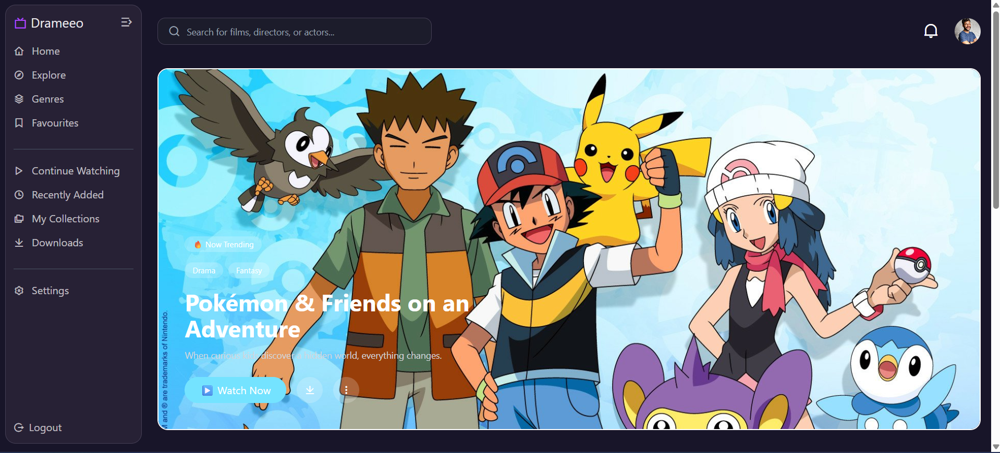

# Day 73 Task | Cohort 2.0

This repository contains the work completed as part of **Day 71** in **Sheryians Coding School Cohort 2.0**.  
The focus of this task was to build a **cartoon showcase UI using React**, emphasizing clean card design, visual hierarchy, and consistent styling with Tailwind CSS.

## 🖼️ UI Preview

### 🔹 Cartoon Cards UI
Below is the final UI showcasing **90s & 2000s classic cartoons** using reusable card components.

## 🧩 Features Implemented

| Feature | Description |
|------|-------------|
| 🎴 Reusable Card Component | Single Card component used to render all cartoon data |
| 🖼️ Image Handling | Proper image containment using object-cover and fixed height |
| 📝 Cartoon Details | Name, genre, short description, era, and rating |
| 🎨 Clean UI Design | Light theme with soft accent colors |
| 📐 Consistent Layout | Equal-height cards with controlled spacing |
| 🔁 Dynamic Rendering | Cards rendered dynamically using map() |
| ✨ Hover Effects | Subtle shadow and image scale on hover |

## ✨ Key Learning Highlights

You learned to:
- Create reusable UI components in React  
- Pass and consume props efficiently  
- Render lists dynamically using `.map()`  
- Maintain visual consistency across cards  
- Improve UI aesthetics using Tailwind CSS  
- Balance content density in card-based layouts  

## 🛠️ Technologies Used

- JavaScript (ES6+)  
- React.js  
- Tailwind CSS  
- HTML5  

## 📖 Learning Outcome

By completing Day 71, I understood:
- How to structure a card-based UI in React  
- How to design clean and readable components  
- Effective use of Tailwind utility classes  
- Managing layout, spacing, and hover states  
- Building presentable, portfolio-ready UIs  

## 🌟 Acknowledgement

This task was completed under the guidance of **Sarthack Bhaiya**  
as part of **Sheryians Coding School – Cohort 2.0**.

---
